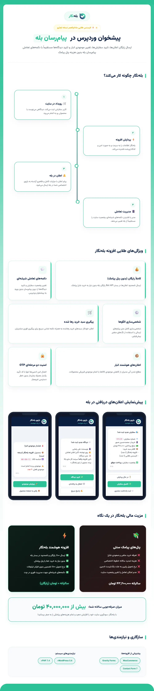

# 🚀 افزونه بله‌نگار (BaleNegar) | دستیار هوشمند مدیریت وردپرس و ووکامرس در پیام‌رسان بله

آیا از بررسی مداوم پیشخوان وردپرس خسته شده‌اید؟ آیا هزینه‌های سرسام‌آور سامانه‌های پیامکی و عدم تحویل پیام‌ها به دلیل بلک‌لیست تبلیغاتی مشتریان، کارایی سایت شما را کاهش داده است؟ 

**افزونه بله‌نگار (BaleNegar)** یک پل ارتباطی زنده، امن و کاملاً رایگان بین وب‌سایت وردپرسی شما و پیام‌رسان بله ایجاد می‌کند. با بله‌نگار، کل سایت و فروشگاه ووکامرسی شما در جیب شماست! بدون نیاز به خرید پنل‌های پیامکی گران‌قیمت یا تمدید سالانه خطوط اختصاصی، تمام اعلان‌های سفارشات جدید، نظرات کاربران، وضعیت انبار و حتی گزارش‌های دوره‌ای فروش را با دکمه‌های تعاملی شیشه‌ای و نرخ تحویل ۱۰۰٪ مستقیماً روی گوشی موبایل خود مدیریت کنید.

---

### 📊 در یک نگاه: بله‌نگار چگونه مدیریت سایت شما را دگرگون می‌کند؟

پیش از بررسی جزئیات، در تصویر زیر می‌توانید نقشه راه ارتباطی و ویژگی‌های برجسته این افزونه بی‌نظیر را مشاهده کنید:

---

## 💎 چرا مدیران حرفه‌ای سایت، بله‌نگار را انتخاب می‌کنند؟ (مزایای کلیدی)

### ۱. مدیریت و پردازش هوشمند سفارشات ووکامرس (WooCommerce Orders Management)
به محض ثبت سفارش جدید در سایت، ربات بله‌نگار جزئیات کامل سفارش شامل مشخصات خریدار (نام، شماره تماس، ایمیل)، آدرس پستی، اقلام سبد خرید و وضعیت پرداخت را برای شما ارسال می‌کند. جذاب‌ترین بخش؟ **دکمه‌های تعاملی شیشه‌ای (Inline Keyboard)** هستند که به شما اجازه می‌دهند بدون نیاز به ورود به پیشخوان وردپرس، وضعیت سفارش را به «در حال پردازش»، «تکمیل شده» یا «لغو شده» تغییر دهید یا مستقیماً یادداشت سفارش (Order Note) ثبت کنید.

### ۲. تایید و پاسخ‌دهی فوق‌سریع به دیدگاه‌ها (WordPress Comments Moderation)
ارتباط فعال با کاربران، کلید موفقیت سئو و فروش سایت است. با بله‌نگار، به محض ثبت دیدگاه جدید، نوتیفیکیشن حاوی متن دیدگاه و اطلاعات نویسنده برای شما ارسال می‌شود. شما می‌توانید نظرات را با یک کلیک تایید کنید، به زباله‌دان بفرستید یا با زدن دکمه پاسخ در پیام‌رسان بله، جواب خود را تایپ و ارسال کنید تا ربات آن را فوراً زیر همان دیدگاه با نام و نشان مدیر سایت منتشر کند.

### ۳. بازیابی هوشمند سبدهای خرید رها شده (Abandoned Carts Recovery)
بیش از ۷۰ درصد مشتریان، محصولات را به سبد خرید خود اضافه کرده اما خرید خود را ناتمام رها می‌کنند. بله‌نگار سبدهای خرید کاربران عضو و مهمان را رصد کرده و در صورت عدم تکمیل خرید پس از مدت‌زمان مشخص (مثلاً ۶۰ دقیقه)، اطلاعات تماس مشتری و اقلام سبد خرید را به شما گزارش می‌دهد تا با ارائه کدهای تخفیف اختصاصی یا تماس تلفنی، این فروش‌های از دست رفته را به چرخه سودآوری بازگردانید.

### ۴. گزارش‌های دوره‌ای و هوشمند فروش (Periodic Sales Reports)
بدون نیاز به باز کردن داشبورد وردپرس، گزارش‌های مالی و تحلیلی فروش سایت خود را به صورت روزانه، هفتگی و ماهانه دریافت کنید. این گزارش‌ها شامل میزان فروش کل، تعداد سفارش‌ها، پرفروش‌ترین محصولات و تعداد مشتریان جدید است. علاوه بر گزارش‌های خودکار، با فرستادن دستوراتی مانند `/report daily` یا `/report weekly` می‌توانید در هر ثانیه گزارش لحظه‌ای را دریافت کنید.

### ۵. مانیتورینگ موجودی انبار کالاها (WooCommerce Stock Alerts)
دیگر نگران اتمام ناگهانی موجودی محصولات محبوب خود نباشید. بله‌نگار با کاهش موجودی کالا به زیر حد آستانه یا اتمام کامل آن، بلافاصله به شما هشدار داده و دکمه لینک مستقیم ویرایش محصول را ارائه می‌دهد تا در سریع‌ترین زمان ممکن قیمت را تغییر داده یا موجودی را شارژ کنید.

### ۶. پایش وضعیت بکاپ‌های سایت (WordPress Backup Alerts)
سازگاری کامل با افزونه‌های محبوبی نظیر UpdraftPlus، BackWPup و All-in-One WP Migration به بله‌نگار اجازه می‌دهد تا پس از هر فرآیند پشتیبان‌گیری، موفقیت‌آمیز بودن آن را اعلام کند. در صورت بروز خطا در سرور نیز، متن دقیق خطا ارسال می‌شود تا امنیت داده‌های سایت شما هرگز به خطر نیفتد.

### ۷. اطلاع‌رسانی خودکار و حرفه‌ای کانال بله (Channel Broadcasting)
با بله‌نگار می‌توانید جدیدترین مقالات، محصولات و تغییر قیمت کالاها را با قالب‌های شکیل و دکمه‌های شیشه‌ای «ادامه مطلب» یا «خرید محصول» به صورت کاملاً خودکار در کانال عمومی فروشگاه خود منتشر کنید تا مشتریان از آخرین جشنواره‌ها و تخفیف‌ها مطلع شوند.

### ۸. شخصی‌سازی بی‌حد و مرز الگوهای پیام (Template Customizer & Live Preview)
بله‌نگار مجهز به یک ویرایشگر بصری با قابلیت Drag & Drop متغیرها و پیش‌نمایش زنده است. شما می‌توانید ساختار تمامی پیام‌های ارسالی به مدیران یا کانال را مطابق با لحن برند خود طراحی و ویرایش کنید.

---

## 🪙 مقایسه مالی: بله‌نگار در برابر پنل‌های پیامکی سنتی

استفاده از پنل‌های پیامکی هزینه‌های پنهان و آشکار زیادی دارد. جدول زیر نشان می‌دهد که چرا خرید افزونه بله‌نگار یک سرمایه‌گذاری بی‌نهایت سودآور است:

| ویژگی‌ها | سامانه‌های پیامکی سنتی | افزونه هوشمند بله‌نگار (BaleNegar) |
| :--- | :--- | :--- |
| **هزینه ارسال پیام‌ها** | دارای تعرفه‌های صعودی و متغیر به ازای هر پیامک | **کاملاً رایگان و نامحدود** (بدون ریالی هزینه اضافه) |
| **هزینه تمدید خط اختصاصی** | پرداخت سالانه از ۵۰۰,۰۰۰ تومان به بالا | **رایگان مادام‌العمر** |
| **نرخ تحویل پیام‌ها (Deliverability)** | ۶۰٪ الی ۸۰٪ (به دلیل بلاک بودن پیامک‌های تبلیغاتی) | **۱۰۰٪ تضمین‌شده** (ارسال آنی روی بستر اینترنت) |
| **دکمه‌های تعاملی شیشه‌ای** | ❌ ندارد (فقط متن ساده غیرقابل تعامل) | **✅ دارد** (امکان تغییر وضعیت سفارش در چت) |
| **پاسخ مستقیم به دیدگاه‌ها** | ❌ غیرممکن است | **✅ دارد** (پاسخ در بله = ثبت نظر در وردپرس) |
| **ارسال فایل‌های لاگ و بکاپ** | ❌ محدودیت شدید کاراکتر | **✅ دارد** (ارسال فایل‌های سیستمی و خروجی‌های JSON) |

> 💡 **یک محاسبه ساده:** اگر وب‌سایت شما ماهانه حدود ۲,۰۰۰ پیام اعلان یا سفارش داشته باشد، سالانه بیش از **۲,۸۸۰,۰۰۰ تومان** هزینه پیامک پرداخت خواهید کرد. با بله‌نگار این هزینه برای همیشه به **صفر** می‌رسد و افزونه در همان ماه‌های اول هزینه خرید خود را جبران می‌کند!

---

## 🛠 مشخصات فنی و پیش‌نیازها

افزونه بله‌نگار با کدهای استاندارد و بهینه توسعه یافته است تا سبک‌ترین کارایی را روی سرور شما داشته باشد و سرعت سایت را کاهش ندهد:

* **نسخه PHP مورد نیاز:** حداقل PHP 7.4 (کاملاً سازگار با نسخه‌های جدید PHP 8.0 تا 8.3)
* **نسخه وردپرس:** سازگار با وردپرس نسخه 5.8 و بالاتر
* **پیش‌نیاز فروشگاهی:** فعال بودن ووکامرس نسخه 3.0 و بالاتر (برای بخش سفارشات، انبار و گزارش‌ها)
* **سازگاری با فرم‌سازها:** Gravity Forms و Contact Form 7
* **سازگاری با بکاپ‌گیرها:** UpdraftPlus، BackWPup و All-in-One WP Migration
* **ترافیک مصرفی:** بهینه‌سازی شده با متدهای غیرهمگام (Asynchronous API) جهت سرعت حداکثری و پهنای باند حداقلی.

---

## 🔒 امنیت داده‌ها و احراز هویت هوشمند

بخش مدیریت وب‌سایت بسیار حساس است. بله‌نگار با بهره‌گیری از پروتکل‌های امنیتی چندلایه، امنیت کامل داده‌های شما را تضمین می‌کند:
1. **اتصال امن OTP:** اتصال ادمین‌ها و انبارداران جدید به ربات تنها از طریق ایجاد و وارد کردن کد امنیتی یک‌بار مصرف ۱ دقیقه‌ای صورت می‌گیرد.
2. **کدنویسی ضد هک:** تمام دستورات بازگشتی از پیام‌رسان بله به سایت با متدهای اعتبارسنجی وردپرس (`Nonces` و `Sanitization`) بررسی و فیلتر می‌شوند تا جلوی هرگونه نفوذ و تزریق کد گرفته شود.
3. **رمزنگاری توکن‌ها:** ارتباط با پیام‌رسان از طریق Bot API اختصاصی بله و توکن‌های کاملاً رمزنگاری‌شده انجام می‌گیرد.

---

## ❓ سوالات متداول کاربران

**۱. آیا برای اتصال بله‌نگار نیاز به خرید پنل پیامکی یا خرید هاست خارج از کشور داریم؟**  
خیر. بله‌نگار از بستر وب‌سرویس رایگان پیام‌رسان داخلی بله استفاده می‌کند و نیازی به سرورهای خارج یا فیلترشکن ندارد. تمامی اتصالات روی هاست‌های معمولی ایران یا خارج به بهترین شکل کار می‌کنند و کاملاً رایگان هستند.

**۲. آیا می‌توانیم چندین ادمین را به ربات متصل کنیم؟**  
بله. شما می‌توانید به تعداد نامحدود ادمین، مدیر انبار، انباردار یا کارشناس فروش را از طریق اتصال امن OTP به ربات متصل کنید تا بر اساس نقش خود اعلان‌ها را دریافت کرده و به آن‌ها پاسخ دهند.

**۳. آیا استفاده از این افزونه باعث کند شدن سایت وردپرسی می‌شود؟**  
به هیچ وجه. تبادل اطلاعات بین وردپرس و بله به صورت کاملاً غیرهمگام (Async) انجام می‌شود. یعنی ثبت سفارش یا ثبت دیدگاه مشتری ثانیه‌ای متوقف نشده و درخواست ارسال اعلان در پس‌زمینه هاست انجام می‌شود.

**۴. چطور باید ربات بله را بسازیم؟**  
این کار کمتر از ۲ دقیقه زمان می‌برد. کافیست در پیام‌رسان بله به ربات رسمی «بازوی‌ساز» (`@BotFather`) بروید، یک بازوی جدید ساخته و توکن آن را کپی کرده و در بخش تنظیمات افزونه بله‌نگار وارد کنید.

---

## 🛒 آماده‌اید مدیریت سایت خود را لذت‌بخش‌تر کنید؟

با تهیه افزونه **بله‌نگار**، نه تنها در هزینه‌های پیامکی سایت صرفه‌جویی چشمگیری می‌کنید، بلکه سرعت پاسخ‌گویی به مشتریان را به شدت بالا برده و از هر نقطه‌ای از جهان، با گوشی همراه خود بر فروشگاه‌تان تسلط کامل خواهید داشت.

**نسخه ۱.۰.۰ پایدار و سازگار با آخرین تغییرات ووکامرس هم‌اکنون آماده خرید و دانلود فوری است!**

* 📞 **پشتیبانی:** ۶ ماه پشتیبانی رایگان و تخصصی از طریق تیکت
* 🔄 **بروزرسانی:** دریافت تمامی آپدیت‌های آینده به صورت مادام‌العمر و رایگان
* 🛡️ **ضمانت:** تضمین کیفیت عملکرد و بازگشت وجه در صورت عدم کارایی فنی
